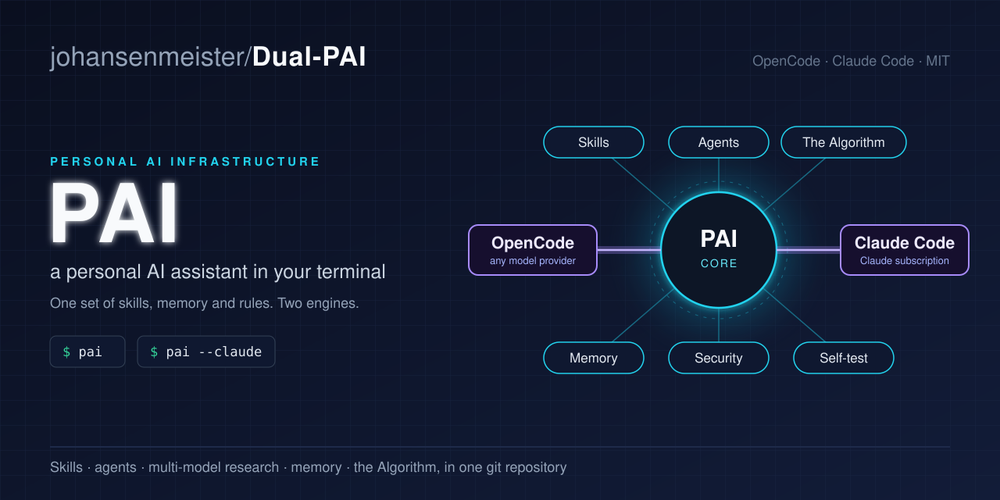
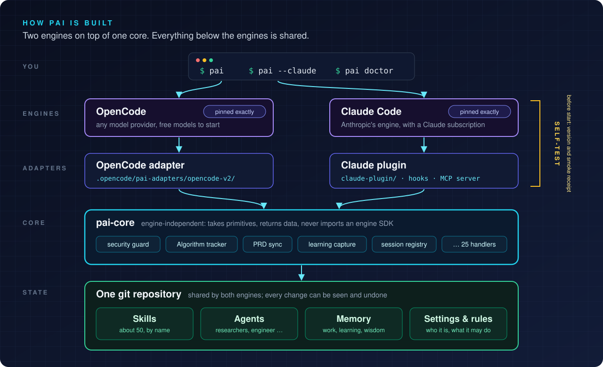
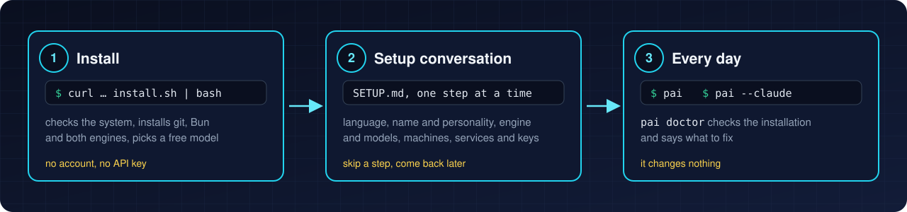
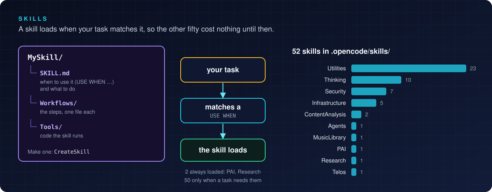
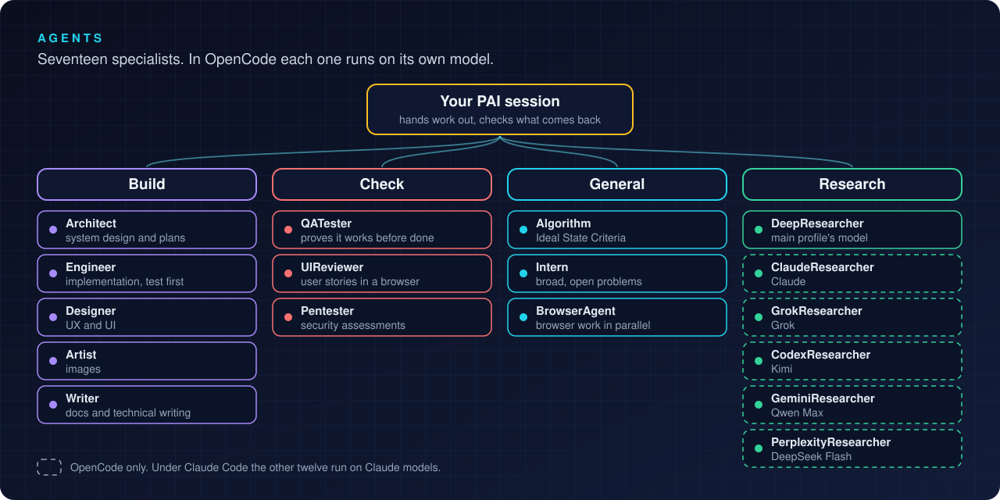
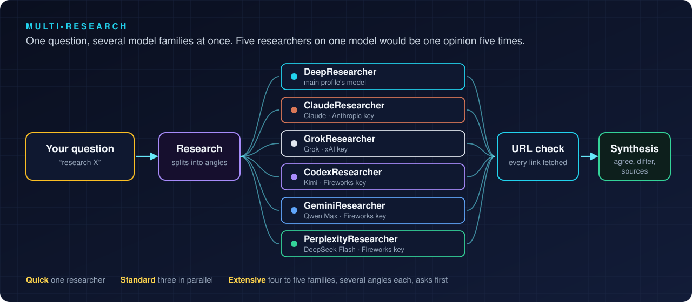
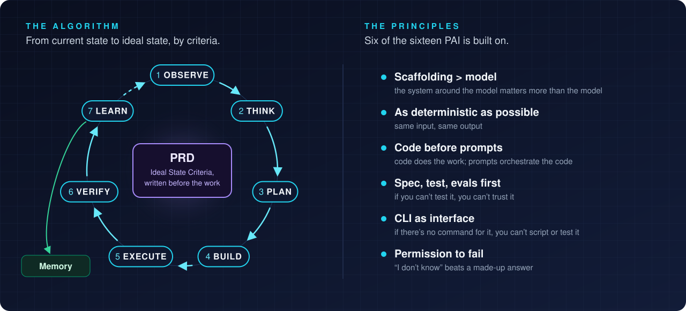
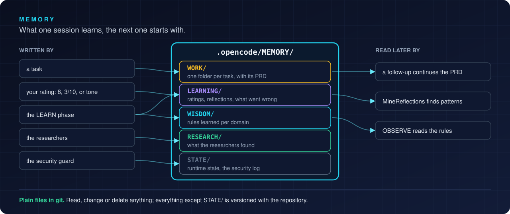
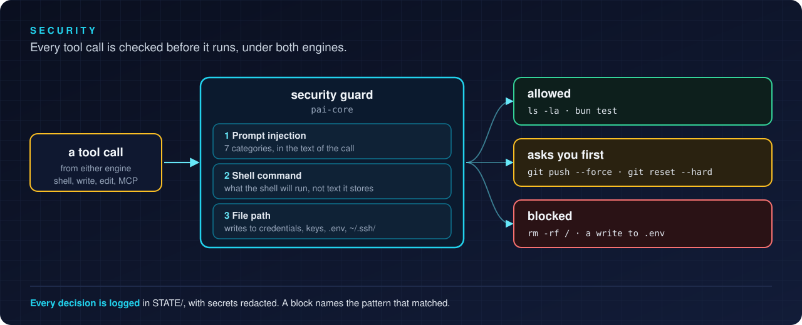
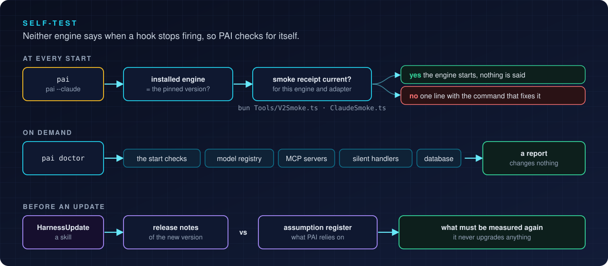

# PAI — a personal AI assistant in your terminal

[](LICENSE)
[](https://github.com/anomalyco/opencode)
[](https://docs.anthropic.com/en/docs/claude-code)
[](https://bun.sh)
[](#install)

**[Install](#install)** · [Make it yours](#make-it-yours) · [Skills](#skills) · [Agents](#agents) · [The Algorithm](#the-algorithm) · [Memory](#memory) · [Security](#security) · [Self-test](#self-test) · [Keeping it current](#keeping-it-current) · [For developers](#for-developers)

PAI is a set of skills, agents, rules and memory that turn an AI model into a
personal assistant. It runs inside an agent program in the terminal, and works
with two of them: **OpenCode** (any model provider, including free models) and
**Claude Code** (Anthropic's, with a Claude subscription). Both share the same
skills, memory and settings, so you can switch between them.

Everything PAI is lives in one git repository: this one, once you have cloned
it. Git keeps the history, so every change can be seen and undone.

> [!TIP]
> **This is meant to become your AI.** PAI ships with 52 ready-to-use skills and
> 17 agents, and every one of them is a plain text file you can read. Open them,
> change them, perfect them, write your own: see [Make it yours](#make-it-yours).



## The idea

PAI follows Daniel Miessler's view that the scaffolding around a model matters
more than the model: skills it can call by name, memory that carries over from
one session to the next, checks that stop what must not happen, and code wherever
code can do the job. The six parts around the core in the banner each have a
section below: [Skills](#skills), [Agents](#agents), [The Algorithm](#the-algorithm),
[Memory](#memory), [Security](#security) and [Self-test](#self-test).

## Install

Linux and WSL2 are supported. macOS works (tested on an Intel Mac with macOS 15
and Apple's Command Line Tools); Apple Silicon is not tested yet.



You need no account and no API key to start. In a terminal:

```bash
curl -fsSL https://raw.githubusercontent.com/johansenmeister/dual-pai/main/install.sh | bash
```

or, on a system with `wget` and no `curl`:

```bash
wget -qO- https://raw.githubusercontent.com/johansenmeister/dual-pai/main/install.sh | bash
```

To clone from somewhere else, such as your own fork, add `-s -- --repo <git url>`
after `bash`. If you have cloned already, run `./install.sh` in the clone.

`install.sh` does the parts that have one right answer: it checks the system,
installs git, Bun and a few tools, clones PAI to `~/repos/pai` (`--dir` picks
another folder), installs the two engines at the versions PAI is tested with,
and picks a free model. Then it opens OpenCode with the setup conversation.

## The setup conversation

`SETUP.md` is a runbook the assistant follows with you, one step at a time:
your language, your assistant's name and personality, which engine and models
you want, your machines, the services it may use and their keys, where faults
and ideas go, and access from another computer. Each choice comes with a short
text on what it is, what it needs, what it costs and whether you can change it
later. You can skip steps and come back.

The free model is only for the setup; you choose your own in step 5. Your keys
go in `~/.opencode/.env`, which you fill in yourself: the assistant never reads
it.

## Every day

| Command | What it does |
|---|---|
| `pai` | starts PAI in OpenCode |
| `pai --claude` | starts PAI in Claude Code |
| `pai keys` | shows which keys are set, never their values |
| `pai doctor` | checks the installation and says what to fix; changes nothing |

`guide/` has short guides for you: where things are, API keys, faults and
improvements, your own Gitea, engine updates, remote access and your goals
(TELOS). Start with [guide/README.md](guide/README.md).

## Make it yours

PAI works from the first session, but it is not meant to stay the way it ships.
Nothing is hidden in a binary or behind a service: the instructions, the skills,
the agents and the Algorithm are Markdown, and the hooks and tools are
TypeScript, all in this repository. Read them to see how your assistant thinks,
and change them where it does not think the way you do.

- **Start with who it is, and who you are.** `.opencode/PAI/USER/` holds your
  assistant's name and personality (`DAIDENTITY.md`), what it should know about
  you (`ABOUTME.md`), your machines (`INFRASTRUCTURE.md`), your goals
  (`TELOS/TELOS.md`) and your own rules (`AISTEERINGRULES.md`). These go into
  every session.
- **Read a skill before you lean on it.** Each one is a `SKILL.md` and a few
  workflows in `.opencode/skills/`. Where it works differently from how you work,
  change it, or put a `PREFERENCES.md` in
  `.opencode/PAI/USER/SKILLCUSTOMIZATIONS/<Skill>/` to adjust it without touching
  the skill.
- **Write your own.** Ask your assistant to "create a skill" for something you do
  often; `CreateSkill` writes it in the same structure. An agent is one Markdown
  file in `.opencode/agents/`.
- **Let it learn, and help it.** Rate answers, and now and then read what it
  wrote in `.opencode/MEMORY/LEARNING/`. A lesson that keeps coming back belongs
  in `AISTEERINGRULES.md` or in a skill.
- **Experiment without fear.** It is all in git: commit before you try something,
  and any change can be seen and undone. If you change PAI's own files (outside
  `USER/`) and later `git pull` an update, the two can meet as a merge conflict,
  so for what you want to keep, prefer a skill of your own or the files under
  `USER/`. [guide/where-things-are.md](guide/where-things-are.md) shows which
  files are which.

After you change skills or agents, `pai claude sync` brings them to Claude Code.

## Skills



PAI ships with 52 skills, ready to use from the first session, in
`.opencode/skills/`. A skill is a folder the assistant loads when a task matches
it: a `SKILL.md` that says when to use it ("USE WHEN …") and what to do,
workflows for the steps, and tools written as code. Two are always
loaded, `PAI` (how the system itself works) and `Research`; the other 50 are
loaded only when a task calls for them, so they cost no context until then.
Some of them:

| Group | Skills |
|---|---|
| **Thinking** | FirstPrinciples, Council (agents debate a question), RedTeam, SystemsThinking, RootCauseAnalysis, Science, BeCreative, IterativeDepth |
| **Security** | ThreatModel, WebAssessment (with OSINT), PromptInjection, Recon, SECUpdates |
| **Research and content** | Research, ExtractWisdom, Fabric (over 200 prompt patterns), Parser |
| **Documents** | Docx, Xlsx, Pptx, Pdf |
| **Building** | CreateSkill, CreateCLI, CodeReview, Evals, Hardening, Prompting, Browser, Cloudflare |
| **Infrastructure** | Proxmox, TrueNAS, Technitium, DockerPortainer |
| **PAI itself** | Agents, Telos (your goals), Delegation, System, HarnessUpdate, ModelUpdate |

`CreateSkill` makes a new one in the same structure; a personal skill is named
with a leading underscore (`_MYSKILL`) so it stands apart from the shareable
ones. To change how a built-in skill behaves without editing it, put a
`PREFERENCES.md` in `.opencode/PAI/USER/SKILLCUSTOMIZATIONS/<Skill>/`; 41 of the
skills read it. Under Claude Code the same skills appear through a generated
mirror (`pai claude sync`).

## Agents



PAI hands parts of a task to agents: specialists with their own instructions,
which the assistant starts in parallel and whose results it checks. There are
17. In OpenCode each one has its own model, set by a profile in
`.opencode/profiles/` (`zen`, `fireworks`, `anthropic`, `openai`, `local` and
more), so a coding agent can run on a coding model and a quick lookup on a cheap,
fast one: `bun .opencode/tools/switch-provider.ts <profile>`.

| | Agent | What it does |
|---|---|---|
| **Build** | Architect | system design, specs and implementation plans |
| | Engineer | implementation, test first |
| | Designer | UX and UI design |
| | Artist | images: the prompt and the image model |
| | Writer | documentation and technical writing |
| **Check** | QATester | checks that it actually works before anything is called done |
| | UIReviewer | runs user stories in a browser, with screenshots, and reports pass or fail |
| | Pentester | security assessments, for the `WebAssessment` skill |
| **General** | Algorithm | writes and sharpens the Algorithm's Ideal State Criteria |
| | Intern | a high-agency generalist for broad problems |
| | BrowserAgent | headless browser work in parallel: scraping, forms, screenshots |
| **Research** | DeepResearcher | thorough investigations, on the main profile's model |
| | ClaudeResearcher, GrokResearcher, CodexResearcher, GeminiResearcher, PerplexityResearcher | one model family each, see [Multi-research](#multi-research) |

The `Agents` skill composes new agents from traits, and `Council` in the
`Thinking` skill lets agents debate a question.

Under Claude Code, twelve of them run on Claude models. The five provider
researchers are OpenCode only: under one subscription they would have no model of
their own, and DeepResearcher covers the role.

### Multi-research



The researcher agents exist for one reason: to look at the same question through
different model families. Five researchers on one model is one opinion five
times. The `Research` skill splits a question into angles and sends them out in
parallel. Every URL the researchers return is fetched before it is used, since
research agents invent links. The answer is a synthesis: where the sources agree,
where they differ, and where each claim comes from.

| Mode | Say | Researchers |
|---|---|---|
| Quick | "research X" | one |
| Standard | "standard research", "research X from multiple angles" | three in parallel |
| Extensive | "extensive research" | four to five model families, several angles each; asks before it starts |

Without extra keys, every researcher runs on the main profile's model. Connect
the providers with `/connect`, or put `ANTHROPIC_API_KEY`, `XAI_API_KEY` and
`FIREWORKS_API_KEY` in `~/.opencode/.env`, and switch with `--multi-research`:

```bash
bun .opencode/tools/switch-provider.ts fireworks --multi-research
bun .opencode/tools/switch-provider.ts --researchers   # which model each researcher runs
```

A researcher whose provider has no key falls back to the main profile, and
`--researchers` shows it. The names are older than the routing: GeminiResearcher
and PerplexityResearcher run Qwen Max and DeepSeek Flash on Fireworks, which gives
real model diversity with one key. With a Google or Perplexity key, one line in
`.opencode/profiles/researchers.yaml` moves each back to its own provider.

## The Algorithm

The Algorithm is how PAI works through a task that needs more than a quick
answer. It is Daniel Miessler's, and has its own repository:
[danielmiessler/TheAlgorithm](https://github.com/danielmiessler/TheAlgorithm).
The version PAI runs is in `.opencode/PAI/Algorithm/`.

It moves a task from the current state to an ideal state that can be checked, in
seven phases: OBSERVE (what is asked, and the criteria that will show it is
done), THINK, PLAN, BUILD, EXECUTE, VERIFY (evidence for each criterion) and
LEARN (a reflection on the run, saved to memory). Five effort levels set the time
budget and how many criteria a task needs, from Standard (under two minutes) to
Comprehensive (up to two hours). The criteria and their status are kept in a
[PRD](#the-prd).



### The PRD

PRD stands for Product Requirements Document, a term borrowed from software
teams. In PAI it is one Markdown file per task, `PRD.md` in the task's folder
under `.opencode/MEMORY/WORK/`, and it holds the task's state, so the state does
not live only in the conversation. The assistant writes it; the hooks only read
it. It has up to four sections:

- **Context:** what was asked for and what was not, the constraints and the risks.
- **Criteria:** the Ideal State Criteria, as checkboxes. Each one is a single end
  state that is either true or false: "`bun test` passes with no failures", not
  "run the tests". Anti-criteria (`ISC-A-`) say what must not happen. Larger
  tasks need more of them: at least 8 at the standard effort level, 64 at the
  highest.
- **Decisions:** the choices that were not obvious, with the reason.
- **Verification:** the evidence for each criterion, written in the VERIFY phase.

The frontmatter keeps the status, the current phase and the progress. Because it
is a file, a task outlives the conversation: when the context is compacted, the
criteria and their status go into the summary, and a follow-up on the same task
continues the same PRD. An excerpt:

```markdown
---
id: PRD-20261006-readme-diagrams
title: "Add diagrams to the public README"
status: ACTIVE
effort_level: Standard
last_phase: EXECUTE
verification_summary: "2/8"
---
## Criteria
- [x] ISC-1: README shows the architecture diagram above the install section
- [x] ISC-2: The hero image path resolves in the public copy
- [ ] ISC-3: Diagrams stay readable in GitHub's light and dark themes
- [ ] ISC-A-1: No upstream image describes features this repository lacks
```

## Memory



PAI's memory is plain files in `.opencode/MEMORY/`, so you can read, change or
delete anything in it. Everything except `STATE/` is in git with the rest of the
repository, so you can also see how it changed.

| Folder | What is there |
|---|---|
| `WORK/` | one folder per task, with its PRD |
| `LEARNING/` | ratings, the reflection from each Algorithm run, and notes on what went wrong |
| `WISDOM/` | rules learned per domain (development, architecture, security …), read in OBSERVE and extended in LEARN |
| `RESEARCH/` | what the researcher agents found |
| `STATE/` | runtime state and the security log; stays on the machine |

It learns from you in two ways. Send a number from 1 to 10 (`8`, `3/10`, or
`4 - missed the point`) and it is saved as a rating of the last answer; without
one, the tone of your messages is read as an implicit rating. A low rating also
writes a note on what went wrong. `bun .opencode/PAI/Tools/MineReflections.ts
--dry-run` looks for patterns across the reflections.

## Security



Every tool call passes through the security guard in `pai-core` before it runs,
under both engines:

- **Prompt injection.** The text in each tool call is checked against patterns
  in seven categories (instruction override, role hijacking, system
  prompt extraction, safety bypass, context separators, MCP tool injection and
  credential leaks). A match is blocked.
- **Shell commands.** The guard matches what the shell will actually run, not
  text it only writes to a file. Destructive commands such as `rm -rf /` are
  blocked; risky ones such as `git push --force` and `git reset --hard` ask you
  first. The message names the pattern that matched.
- **Credentials.** Writes to `.env` files, `~/.ssh/`, GnuPG, cloud and cluster
  credentials, private keys and `/etc/` are blocked outright: those are changed
  by hand. Your keys live in `~/.opencode/.env`, and the assistant never reads it;
  `pai keys` shows which are set, never their values.
- **The log.** Every decision is written to a security log in `STATE/` (see
  [Memory](#memory)), with secrets redacted.

The `Security` skills go the other way: threat models, web assessments with
OSINT, recon and prompt-injection testing of your own systems.

## Self-test



Neither engine says so when a hook PAI depends on stops firing, and an engine
update can change what PAI assumes about it. So PAI checks itself:

- **At every start.** Both engines are pinned to an exact version in
  `.opencode/package.json`, and each has a smoke test that runs the real engine
  with PAI and writes a receipt when every hook has fired and the security guard
  has blocked what it should: `bun Tools/V2Smoke.ts` and `bun Tools/ClaudeSmoke.ts`.
  `pai` and `pai --claude` check that the installed engine is the pinned one, and
  that the smoke test passed against it and against the adapter code as it is
  now. If not, you get one line with the command that fixes it; otherwise
  nothing.
- **On demand.** `pai doctor` runs the same checks and the slower ones: the model
  registry, the MCP servers, handlers that ran without effect, and the database.
  It changes nothing.
- **Before an update.** The `HarnessUpdate` skill reads the engines' release notes
  against its register of what PAI assumes about each engine, and says what must
  be measured again. It never upgrades anything
  ([guide/engine-updates.md](guide/engine-updates.md)).

## Keeping it current

The engines are pinned on purpose. PAI hooks into each engine's events, tool
names and data, and a new version can change one of them without any error:
nothing crashes, PAI just stops guarding or remembering something. That has
happened: one Claude Code version cut the context PAI gives every session to its
first 2 KB, and nothing said so. So a new engine version comes in only after it
has been checked, and `claude update`, `opencode upgrade` and the engines' own
update prompts are never used: they move past the pin without the check.
`pai version` shows the pinned and the installed version of each.

Two skills keep PAI current. Run them yourself now and then; neither runs on a
timer, and neither changes anything without you:

| Say | Skill | What it does |
|---|---|---|
| "check the engines for updates" | `HarnessUpdate` | reads what changed in a new engine version against what PAI depends on, and sorts each change into "may break", "fixes something" or "harmless". It never upgrades; if you go ahead, the smoke test decides. [guide/engine-updates.md](guide/engine-updates.md) |
| "update models" | `ModelUpdate` | checks every model ID in the OpenCode profiles against OpenCode's model registry, so a retired model is replaced before an agent fails, and weighs new models per role. The change is a branch you merge. [guide/model-updates.md](guide/model-updates.md) |

## For developers

Parts of the code comments and the skills are in Norwegian: they come from the
repository PAI is copied from.

| | |
|---|---|
| **`.opencode/pai-core/`** | The engine-independent core. Never imports an engine SDK |
| **`.opencode/pai-adapters/opencode-v2/`** | The OpenCode side, with OpenCode pinned exactly in `.opencode/package.json` |
| **`claude-plugin/`** | The Claude Code side: hooks, MCP server, a generated mirror of the skills and agents |
| **`.opencode/skills/`** | About 50 skills, including `Infrastructure/` |
| **`.opencode/skills/Utilities/HarnessUpdate/AssumptionRegister.md`** | What PAI assumes about each engine, and what the smoke tests guard |

```bash
bun install
(cd .opencode && bun install)   # the OpenCode binary and types, about 780 MB
bun test                        # green out of the box
bun run lint
```

Both installs are needed: the one in the root does not cover `.opencode/`, and
without it the type check in `bun test` has neither the binary nor the types.

The self-test and the smoke tests are described under [Self-test](#self-test).
A bump of either engine is not done until its smoke test is green.

**Three things worth knowing before you change anything:**

- **The core never imports an engine SDK.** The two-engine design rests on
  `pai-core/` taking primitives and returning data. A grep for `harness ===`
  should hit only `runtime.ts` and the adapters, and a test guards it.
- **`claude-plugin/skills/` and `claude-plugin/agents/` are generated.** Edit
  the source under `.opencode/skills/` and run `pai claude sync`. The mirror is
  tracked in git and built from what git tracks, not from what is on disk, and a
  test fails if it drifts from the source.
- **The hook binary is a build artefact.** `bin/pai-hook` falls back to the
  source when it is missing, so everything works without it, only slower. `pai
  claude sync` builds it.

## Where this comes from

PAI is Daniel Miessler's
[Personal AI Infrastructure](https://github.com/danielmiessler/Personal_AI_Infrastructure).
This repository started as a fork of Steffen's port to OpenCode,
[pai-opencode](https://github.com/Steffen025/pai-opencode), and has since been
rebuilt around two engines. [OpenCode](https://github.com/anomalyco/opencode)
is by Anomaly.

This project grew out of my own need for a framework that fits my own way of
working, above all documenting and auditing a homelab and work IT environment:
what runs where, what changed, and why. It has reached a level of maturity where
I'm confident in sharing it with the open-source community.

MIT License, see [LICENSE](LICENSE).
