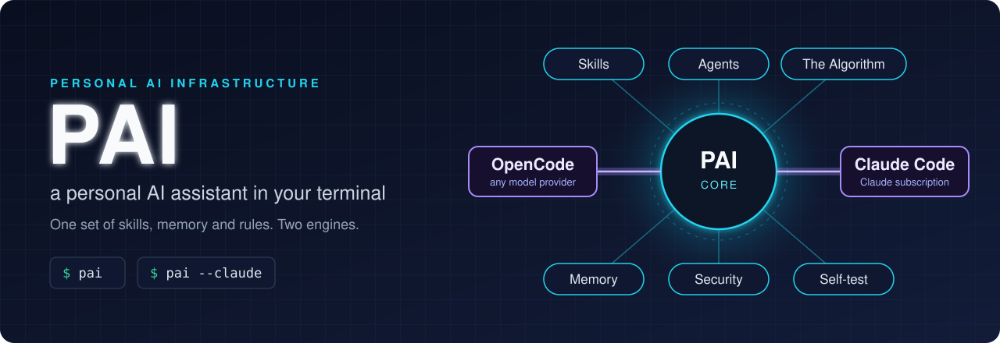

# PAI — a personal AI assistant in your terminal

[](LICENSE)
[](https://github.com/anomalyco/opencode)
[](https://docs.anthropic.com/en/docs/claude-code)
[](https://bun.sh)
[](#install)

PAI is a set of skills, agents, rules and memory that turn an AI model into a
personal assistant. It runs inside an agent program in the terminal, and works
with two of them: **OpenCode** (any model provider, including free models) and
**Claude Code** (Anthropic's, with a Claude subscription). Both share the same
skills, memory and settings, so you can switch between them.

Everything PAI is lives in one git repository: this one, once you have cloned
it. Git keeps the history, so every change can be seen and undone.


## The idea

PAI follows Daniel Miessler's view that the scaffolding around a model matters
more than the model: skills it can call by name, memory that carries over from
one session to the next, and code wherever code can do the job. Larger tasks run
through the Algorithm. Before the work starts, the assistant writes down in a PRD
the criteria that will show the task is done, and the VERIFY phase checks each
one. What it learns goes to memory.


## Install

Linux and WSL2 are supported. macOS works (tested on an Intel Mac with macOS 15
and Apple's Command Line Tools); Apple Silicon is not tested yet.


You need no account and no API key to start. In a terminal:

```bash
curl -fsSL https://raw.githubusercontent.com/johansenmeister/dual-pai/main/install.sh | bash
```

or, on a system with `wget` and no `curl`:

```bash
wget -qO- https://raw.githubusercontent.com/johansenmeister/dual-pai/main/install.sh | bash
```

To clone from somewhere else, such as your own fork, add `-s -- --repo <git url>`
after `bash`. If you have cloned already, run `./install.sh` in the clone.

`install.sh` does the parts that have one right answer: it checks the system,
installs git, Bun and a few tools, clones PAI to `~/repos/pai` (`--dir` picks
another folder), installs the two engines at the versions PAI is tested with,
and picks a free model. Then it opens OpenCode with the setup conversation.

## The setup conversation

`SETUP.md` is a runbook the assistant follows with you, one step at a time:
your language, your assistant's name and personality, which engine and models
you want, your machines, the services it may use and their keys, where faults
and ideas go, and access from another computer. Each choice comes with a short
text on what it is, what it needs, what it costs and whether you can change it
later. You can skip steps and come back.

The free model is only for the setup; you choose your own in step 5. Your keys
go in `~/.opencode/.env`, which you fill in yourself: the assistant never reads
it.

## Every day

| Command | What it does |
|---|---|
| `pai` | starts PAI in OpenCode |
| `pai --claude` | starts PAI in Claude Code |
| `pai keys` | shows which keys are set, never their values |
| `pai doctor` | checks the installation and says what to fix; changes nothing |

`guide/` has short guides for you: where things are, API keys, faults and
improvements, your own Gitea, engine updates, remote access and your goals
(TELOS). Start with [guide/README.md](guide/README.md).

## Agents

PAI hands parts of a task to agents: specialists with their own instructions,
which the assistant starts in parallel and whose results it checks. There are
17. In OpenCode each one has its own model, set by a profile in
`.opencode/profiles/` (`zen`, `fireworks`, `anthropic`, `openai`, `local` and
more), so a coding agent can run on a coding model and a quick lookup on a cheap,
fast one: `bun .opencode/tools/switch-provider.ts <profile>`.

| | Agent | What it does |
|---|---|---|
| **Build** | Architect | system design, specs and implementation plans |
| | Engineer | implementation, test first |
| | Designer | UX and UI design |
| | Artist | images: the prompt and the image model |
| | Writer | documentation and technical writing |
| **Check** | QATester | checks that it actually works before anything is called done |
| | UIReviewer | runs user stories in a browser, with screenshots, and reports pass or fail |
| | Pentester | security assessments, for the `WebAssessment` skill |
| **General** | Algorithm | writes and sharpens the Algorithm's Ideal State Criteria |
| | Intern | a high-agency generalist for broad problems |
| | BrowserAgent | headless browser work in parallel: scraping, forms, screenshots |
| **Research** | DeepResearcher | thorough investigations, on the main profile's model |
| | ClaudeResearcher, GrokResearcher, CodexResearcher, GeminiResearcher, PerplexityResearcher | one model family each, see [Multi-research](#multi-research) |

The `Agents` skill composes new agents from traits, and `Council` in the
`Thinking` skill lets agents debate a question.

Under Claude Code, twelve of them run on Claude models. The five provider
researchers are OpenCode only: under one subscription they would have no model of
their own, and DeepResearcher covers the role.

## Multi-research


The researcher agents exist for one reason: to look at the same question through
different model families. Five researchers on one model is one opinion five
times. The `Research` skill splits a question into angles and sends them out in
parallel. Every URL the researchers return is fetched before it is used, since
research agents invent links. The answer is a synthesis: where the sources agree,
where they differ, and where each claim comes from.

| Mode | Say | Researchers |
|---|---|---|
| Quick | "research X" | one |
| Standard | "standard research", "research X from multiple angles" | three in parallel |
| Extensive | "extensive research" | four to five model families, several angles each; asks before it starts |

Without extra keys, every researcher runs on the main profile's model. Connect
the providers with `/connect`, or put `ANTHROPIC_API_KEY`, `XAI_API_KEY` and
`FIREWORKS_API_KEY` in `~/.opencode/.env`, and switch with `--multi-research`:

```bash
bun .opencode/tools/switch-provider.ts fireworks --multi-research
bun .opencode/tools/switch-provider.ts --researchers   # which model each researcher runs
```

A researcher whose provider has no key falls back to the main profile, and
`--researchers` shows it. The names are older than the routing: GeminiResearcher
and PerplexityResearcher run Qwen Max and DeepSeek Flash on Fireworks, which gives
real model diversity with one key. With a Google or Perplexity key, one line in
`.opencode/profiles/researchers.yaml` moves each back to its own provider.

## For developers

Parts of the code comments and the skills are in Norwegian: they come from the
repository PAI is copied from.

| | |
|---|---|
| **`.opencode/pai-core/`** | The engine-independent core. Never imports an engine SDK |
| **`.opencode/pai-adapters/opencode-v2/`** | The OpenCode side, with OpenCode pinned exactly in `.opencode/package.json` |
| **`claude-plugin/`** | The Claude Code side: hooks, MCP server, a generated mirror of the skills and agents |
| **`.opencode/skills/`** | About 50 skills, including `Infrastructure/` |
| **`.opencode/skills/Utilities/HarnessUpdate/AssumptionRegister.md`** | What PAI assumes about each engine, and what the smoke tests guard |

```bash
bun install
(cd .opencode && bun install)   # the OpenCode binary and types, about 780 MB
bun test                        # green out of the box
bun run lint
```

Both installs are needed: the one in the root does not cover `.opencode/`, and
without it the type check in `bun test` has neither the binary nor the types.

**The self-test.** Both engines are pinned exactly in `.opencode/package.json`
(`@opencode/cli` and `pai.claudeCode`), and each has a smoke test that writes a
receipt: `bun Tools/V2Smoke.ts` and `bun Tools/ClaudeSmoke.ts`. Before an
engine starts, `pai` and `pai --claude` check that the installed version is the
pinned one and that the smoke test has passed against it and against the
adapter code as it is now. If something is wrong, you get one line with the
command that fixes it; otherwise they say nothing. `pai doctor` runs the same
checks and the slower ones: the model registry, the MCP servers, handlers that
run without effect, and the database. Neither engine reports a hook that stops
firing, so a bump is not done until the smoke test is green. The skill
`HarnessUpdate` reads the engines' release notes against its assumption register
and says what must be measured again; it never upgrades anything ([guide/engine-updates.md](guide/engine-updates.md)).

**Three things worth knowing before you change anything:**

- **The core never imports an engine SDK.** The two-engine design rests on
  `pai-core/` taking primitives and returning data. A grep for `harness ===`
  should hit only `runtime.ts` and the adapters, and a test guards it.
- **`claude-plugin/skills/` and `claude-plugin/agents/` are generated.** Edit
  the source under `.opencode/skills/` and run `pai claude sync`. The mirror is
  tracked in git and built from what git tracks, not from what is on disk, and a
  test fails if it drifts from the source.
- **The hook binary is a build artefact.** `bin/pai-hook` falls back to the
  source when it is missing, so everything works without it, only slower. `pai
  claude sync` builds it.

## Where this comes from

PAI is Daniel Miessler's
[Personal AI Infrastructure](https://github.com/danielmiessler/Personal_AI_Infrastructure).
This repository started as a fork of Steffen's port to OpenCode,
[pai-opencode](https://github.com/Steffen025/pai-opencode), and has since been
rebuilt around two engines. [OpenCode](https://github.com/anomalyco/opencode)
is by Anomaly.

The repository is a copy of a private one whose history is mostly its owner's
memory. It starts from a single commit on purpose; later commits are updates
from the original, added on top.

MIT License, see [LICENSE](LICENSE).
